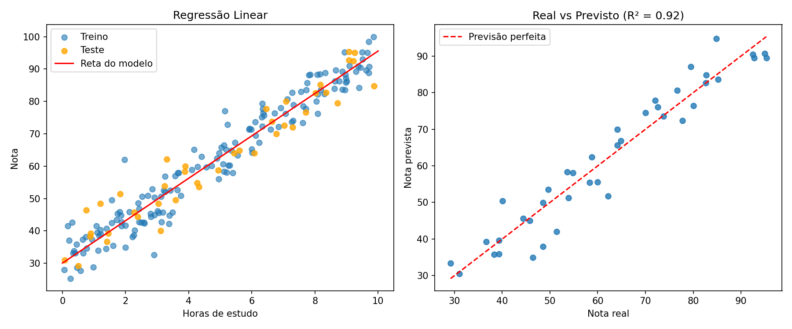

# 📈 Regressão Linear: prevendo notas pelas horas de estudo

Projeto iniciante de Machine Learning em Python. O modelo aprende a relação entre **horas de estudo** e **nota na prova** usando Regressão Linear.

## O que o projeto usa

- **pandas**: carregar e explorar os dados
- **scikit-learn**: `train_test_split`, `LinearRegression` e métricas
- **matplotlib**: gráficos dos resultados

## Estrutura

```
├── data/estudo_notas.csv   # dataset (200 linhas)
├── gerar_dados.py          # gera o dataset fictício
├── main.py                 # treina, avalia e plota
├── requirements.txt
└── resultado.png           # gráficos gerados
```

## Como rodar

```bash
pip install -r requirements.txt
python gerar_dados.py   # opcional, o CSV já está incluído
python main.py
```

## Como funciona

1. Carrega o CSV com pandas
2. Separa `X` (horas de estudo) e `y` (nota)
3. Divide em 80% treino e 20% teste com `train_test_split`
4. Treina o `LinearRegression` nos dados de treino
5. Avalia nos dados de teste (que o modelo nunca viu)
6. Plota a reta do modelo e o gráfico real vs previsto

## Resultados

| Métrica | Valor |
|---|---|
| R² | ~92% |
| MAE | ~4,2 pontos |
| RMSE | ~5,2 pontos |

Equação aprendida: `nota ≈ 30 + 6,5 × horas_estudo`



## Sobre "acurácia" em regressão

Acurácia (% de acertos) é uma métrica de **classificação**. Em regressão, o valor previsto é um número contínuo, então usamos:

- **R²**: quanto da variação da nota o modelo explica (quanto mais perto de 100%, melhor)
- **MAE**: erro médio, em pontos de nota
- **RMSE**: parecido com o MAE, mas pune mais os erros grandes

## Próximos passos

- Usar várias variáveis (regressão linear múltipla)
- Testar com um dataset real (ex.: preços de casas)
- Comparar com outros modelos (Ridge, Random Forest)
